# Kaizo Network Documentation

- [Kaizo Network Documentation](#kaizo-network-documentation)
- [Map Settings](#map-settings)
- [Tiles](#tiles)
  - [Both +KZGame and +KZFront:](#both-kzgame-and-kzfront)
    - [ID 1: Switchable Solid Tile](#id-1-switchable-solid-tile)
    - [ID 2: Solid Stopper](#id-2-solid-stopper)
    - [ID 3: Portal Gun](#id-3-portal-gun)
    - [ID 4: Allow Portal](#id-4-allow-portal)
    - [ID 5: Disallow Portal](#id-5-disallow-portal)
    - [ID 6: Reset Portals](#id-6-reset-portals)
    - [ID 7: Plasma Turret/Damage Turret](#id-7-plasma-turretdamage-turret)
    - [ID 8: Explosive Plasma Turret/Explosive Damage Turret](#id-8-explosive-plasma-turretexplosive-damage-turret)
    - [ID 9: Damage Laser](#id-9-damage-laser)
    - [ID 10: Play map sound (in tile position)](#id-10-play-map-sound-in-tile-position)
    - [ID 11: Health Zone](#id-11-health-zone)
    - [ID 12: Damage Zone/Slow Death](#id-12-damage-zoneslow-death)
    - [ID 13: Mine](#id-13-mine)
    - [ID 14: Play map sound (only for player)](#id-14-play-map-sound-only-for-player)
    - [ID 17: Play map sound (in tile position, only for player)](#id-17-play-map-sound-in-tile-position-only-for-player)
  - [+KZGame Only:](#kzgame-only)
    - [ID 15: No damage](#id-15-no-damage)
    - [ID 16: Button](#id-16-button)
    - [ID 18: Set Camera Position (Spec Position)](#id-18-set-camera-position-spec-position)
    - [ID 19: Switchable Solid Tile (Tee Only)](#id-19-switchable-solid-tile-tee-only)
  - [+KZFront Only:](#kzfront-only)
    - [ID 15: +Pos](#id-15-pos)
    - [ID 16: +KZ Teleport (Switchable Teleport)](#id-16-kz-teleport-switchable-teleport)
    - [ID 18: Switchable Tune Zone](#id-18-switchable-tune-zone)
    - [ID 19: Tune Lock](#id-19-tune-lock)

# Map Settings

* sv_portal_mode "Portal spawning behavior (0 = on every tile, 1 = only on allow portal tile, 2 = pprace compatibility)"
* sv_portal_projectile "Use Kaizo-Insta Portal Projectile instead of Laser"
* sv_portal_laser_reach "Portal gun laser reach"
* sv_max_health "Max amount of life"
* sv_damage_laser_cooldown "Cooldown for damage laser"
* sv_damage_laser_dmg "Damage laser damage"
* sv_damage_turret_dmg "Plasma turret damage"
* sv_damage_turret_explosive_dmg "Explosive plasma turret damage"
* sv_damage_mine_dmg "Mines damage"

# Tiles

## Both +KZGame and +KZFront:

### ID 1: Switchable Solid Tile

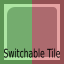

Collision with this tile can be manipulated with a switch, players can not skip it.

You must set Value1, otherwise collision wont work.

Alternative to [ID 19: Switchable Solid Tile (Tee Only)](#id-19-switchable-solid-tile-tee-only)

* Number: Switch Number
* Value1: 1 = Hookable, 3 = Unhookable, Any other value is ignored

### ID 2: Solid Stopper

One way tile, only Tees get affected, players can not skip it.

Tile has NOT switch support

### ID 3: Portal Gun

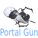

Portal gun pickup

* Number: Switch Number

### ID 4: Allow Portal

Works for sv_portal_mode 1, must be placed on top of a solid tile

Allows placing a portal if player shoot with a portal gun to that tile

Tile has NOT switch support

### ID 5: Disallow Portal

Disallow portal works for sv_portal_mode 0, must be placed on top of a solid tile

Wont allow placing portals on that tile

Tile has NOT switch support

### ID 6: Reset Portals

Destroy all portals made by player

Tile has NOT switch support

### ID 7: Plasma Turret/Damage Turret

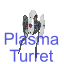

A turret that deals damage

Number: Switch Number

### ID 8: Explosive Plasma Turret/Explosive Damage Turret

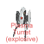

A turret that deals damage and makes explosions

Number: Switch Number

### ID 9: Damage Laser

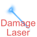

Damage Laser Entity, hurts when touched

* Number: Switch number
* Value1: Rotation speed

### ID 10: Play map sound (in tile position)

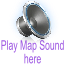

When touched, will play a sound in the tile position for all players

* Number: Switch number
* Value1: Map sound ID

### ID 11: Health Zone

Gives Health

* Number: Switch number
* Value1: How much health to give (Will give Value1 + 1 Health)

### ID 12: Damage Zone/Slow Death

Deals Damage

* Number: Switch number
* Value1: How much damage to deal (Will deal Value1 + 1 Damage)

### ID 13: Mine

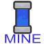

Mine Entity, explodes and deals damage when touched, projectiles also can explode it, will respawn after some time.

Number: Switch Number

### ID 14: Play map sound (only for player)

When touched, will play a sound only for that player, no matter what position he is in.

* Number: Switch number
* Value1: Map sound ID

### ID 17: Play map sound (in tile position, only for player)

When touched, will play a sound in the tile position only for that player

* Number: Switch number
* Value1: Map sound ID

## +KZGame Only:

### ID 15: No damage

Player cant get damage after touching this tile

* Number: Switch Number

### ID 16: Button

* Number: Switch number to handle
* Value1: Switch Type (0 = Deactivate, 1 = Timed deactivate, 2 = Timed activate, 3 = Activate)
* Value2: Delay

### ID 18: Set Camera Position (Spec Position)

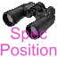

Force player camera to see a specific tile position (NOTE: player will lose client-side prediction, only useful for things like cutscenes)

* Number: Switch number
* Value1: X position
* Value2: Y position

### ID 19: Switchable Solid Tile (Tee Only)

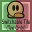

Collision with this tile can be manipulated with a switch.

Only tees can collide with this, weapons and hook wont.

You dont need to set Value1 for this one, unlike [ID 1: Switchable Solid Tile](#id-1-switchable-solid-tile)

* Number: Switch Number

## +KZFront Only:

### ID 15: +Pos

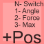

Move player position no matter what, also can limit player velocity on Value3

This is NOT a Speedup tile

* Number: Switch number
* Value1: Angle
* Value2: How much Player is pushed each Tick
* Value3: Max Player velocity in that direction (negative values cancels it)

### ID 16: +KZ Teleport (Switchable Teleport)

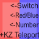

Teleport that can be manipulated with switches

* Number: Switch number
* Value1: Red Teleport = 0, Blue Teleport = 1
* Value2: Teleport number

### ID 18: Switchable Tune Zone

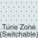

Tune zone but you can handle it with switches

* Number: Switch number
* Value1: Tune Zone

### ID 19: Tune Lock

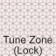

Lock tunes from a tune zone into a player

You can lock a player to tune zone 0 (Global tunes)

To remove lock, lock a player to tune zone **-1**

* Number: Switch Number
* Value1: Tune Zone
