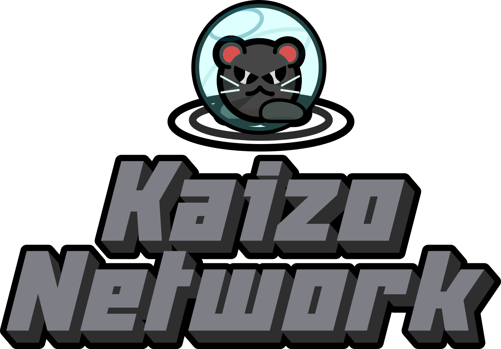

# KAIZO NETWORK HAS BEEN DISCONTINUED, FEEL FREE TO FORK THIS, BUT KEEP YOUR FORK SOURCE CODE PUBLIC AS THE LICENSE SAYS

## What is it?

A DDNet mod made by me (+KZ) that adds extra mapping features that probably never will be added to DDNet, before this Kaizo Network also was a Server Network for DDNet where you could submit maps on there to be played by other people, however i could not keep maintaining the servers so now Kaizo Network is just a mod.

## Is there a place where i can submit maps made for Kaizo Network?

You can share your creations in [my Discord server](/discord.html)

But you can also submit your maps to a friendly community known as "TeeCloud Network", which is using Kaizo Network as their main mod: [https://discord.gg/crS6bzNNqm](https://discord.gg/crS6bzNNqm)

## What are +KZGame and +KZFront Layers?

Custom game layers that only work on Kaizo-Network server and editor, **saving maps on a normal DDNet editor will break the layers content**

[Kaizo-Network Tile Documentation](Doc/)

