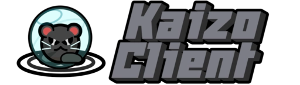
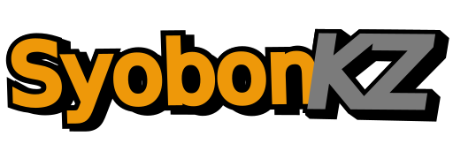

## My Projects:

## Discontinued Projects:

## Random interactive web things:

* [SyobonKZ](SyobonKZ/game.html)
* [3D Decker](3ddecker/)

## Other links:

* [3D Decker](3ddecker/) —— Some not 3D thing i made for [Deck-Month 3 JAM](https://itch.io/jam/deck-month-3) because why not
* [Blogspot backup](blogspot/) —— Backup for the posts i had in Blogspot
* [DDNet CCID standard](https://github.com/M0REKZ/ddnet-custom-clients) —— DDNet custom client identification standard born in Kaizo Client and used by other clients too
* [kaizo-skyblock](https://github.com/M0REKZ/kaizo-skyblock) —— Minetest Skyblock mod modified for the Luanti server i had
* [kaizo-bombtag](https://github.com/M0REKZ/kaizo-bombtag) —— DDNet BOMB game mode merged with Kaizo Network with some random extra features
* [My DDNet Skins](Skins/) —— List of my DDNet skins (may be outdated)
* [Teeworlds archived mod list](twmodlist/) —— Random list with some links for downloading hard to find/lost Teeworlds mods
* [TWplus Hide and Seek](https://pointer31.github.io/twplus.html#:~:text=Hide%20and%20Seek) <small>(External link)</small> —— Improved remake of [Kaizo-Insta](https://m0rekz.github.io/Kaizo-insta/#:~:text=HidNSek
) Hide and Seek (HidNSek) in Teeworlds 0.7

* [Buy me a energy drink](https://ko-fi.com/pluskaizo)

